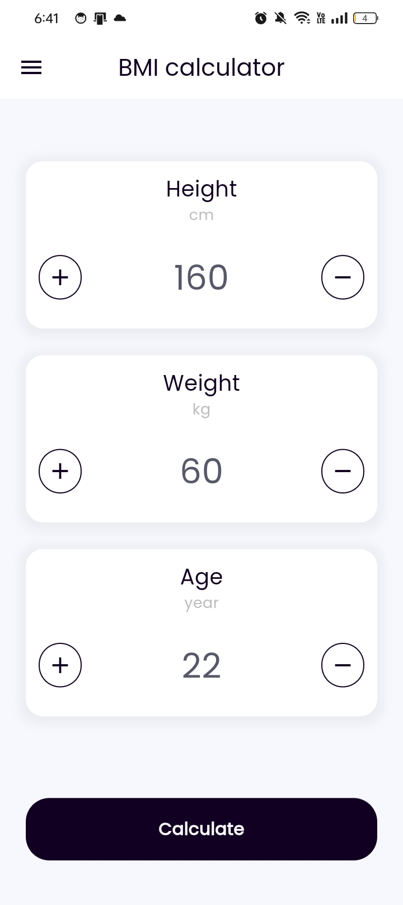
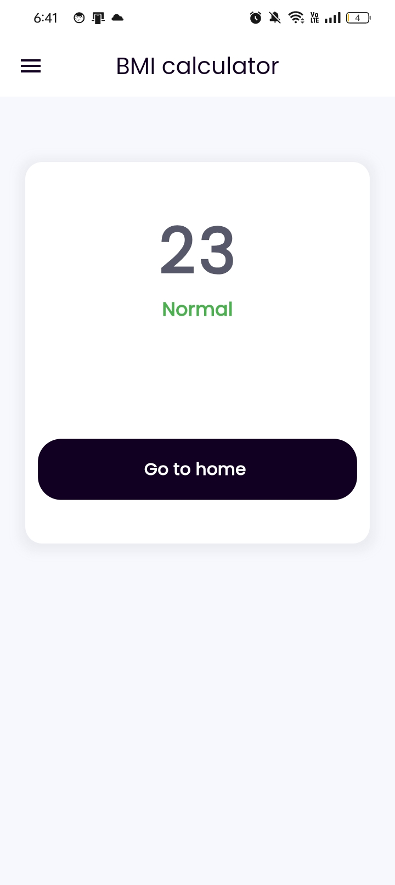
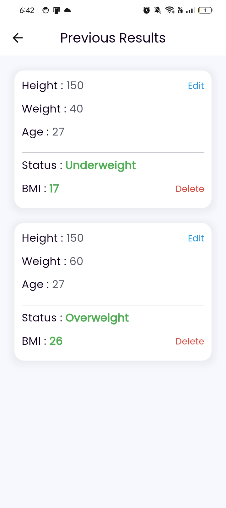

# BMI Calcolator
- Simple BMI app using Firebase Auth and cloud FireStore.
- BloC state management used to manage app's business logic.

  ## ✨ Features
- Sign in as guest
- Calculate BMI.
- Save all results.
- Edit and deletet result.
  
## 🔌 Packages
- cloud_firestore
- firebase_auth
- firebase_core
- firebase_pagination
- flutter_bloc
- flutter_screenutil
- get_it
- shared_preferences

## 📸 ScreenShots
| BMI                                            | Application                                |
| -----------------------------------------      | -------------------------------------------|
|       |   |
|       |   |
